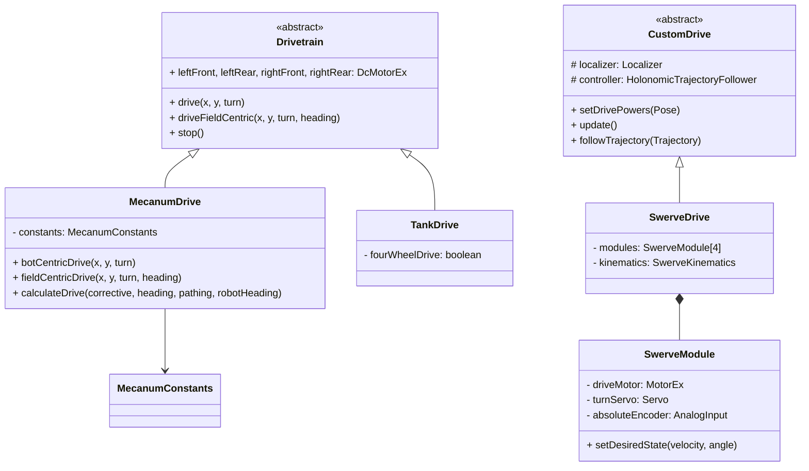
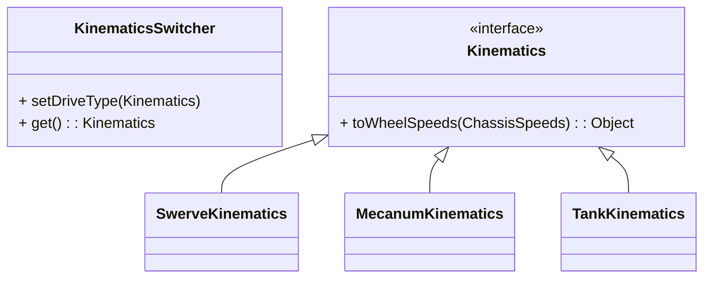
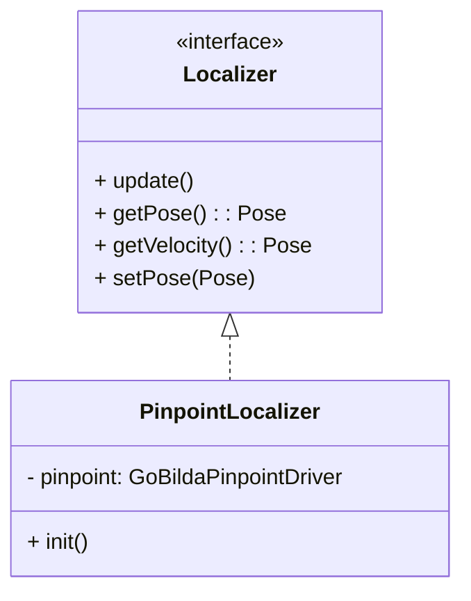
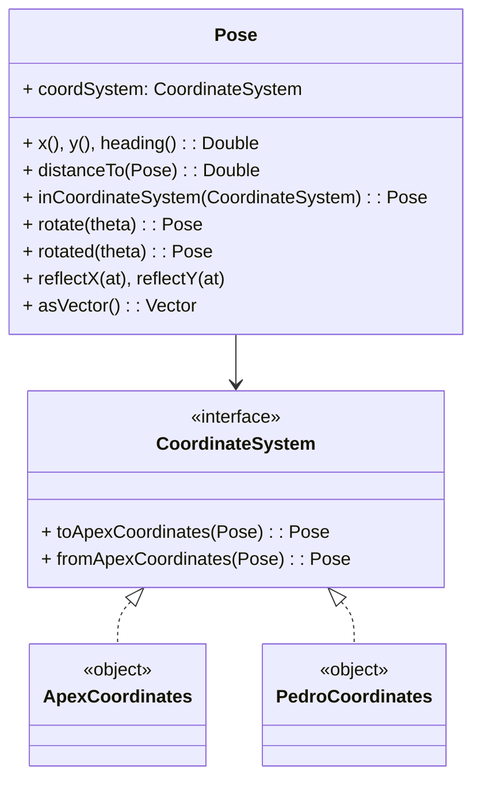
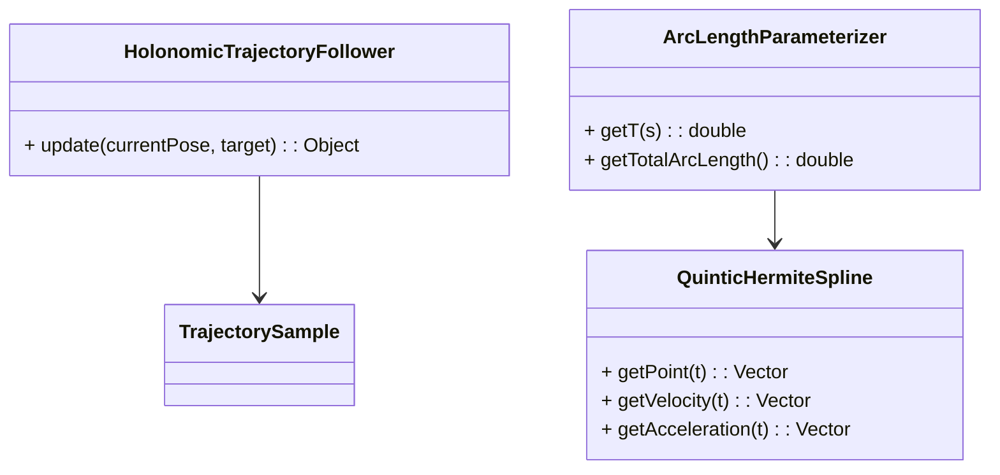

# Apex Pathing Architecture

## Package Overview

```
com.apexpathing
├── kinematics/      Drivetrain kinematics (swerve, mecanum, tank)
├── follower/        Trajectory generation and following
├── drivetrain/      Drive system implementations
├── localization/    Position tracking (Localizer interface + implementations)
├── hardware/        FTC hardware wrappers (MotorEx, LynxModuleUtil)
└── util/
    ├── math/        Pose, Vector, CoordinateSystem (ApexCoordinates, PedroCoordinates)
    └── ...          Controllers and rate limiters
```

## Drive System



## Kinematics



## Localization



## Math Utilities



## Trajectory Following


